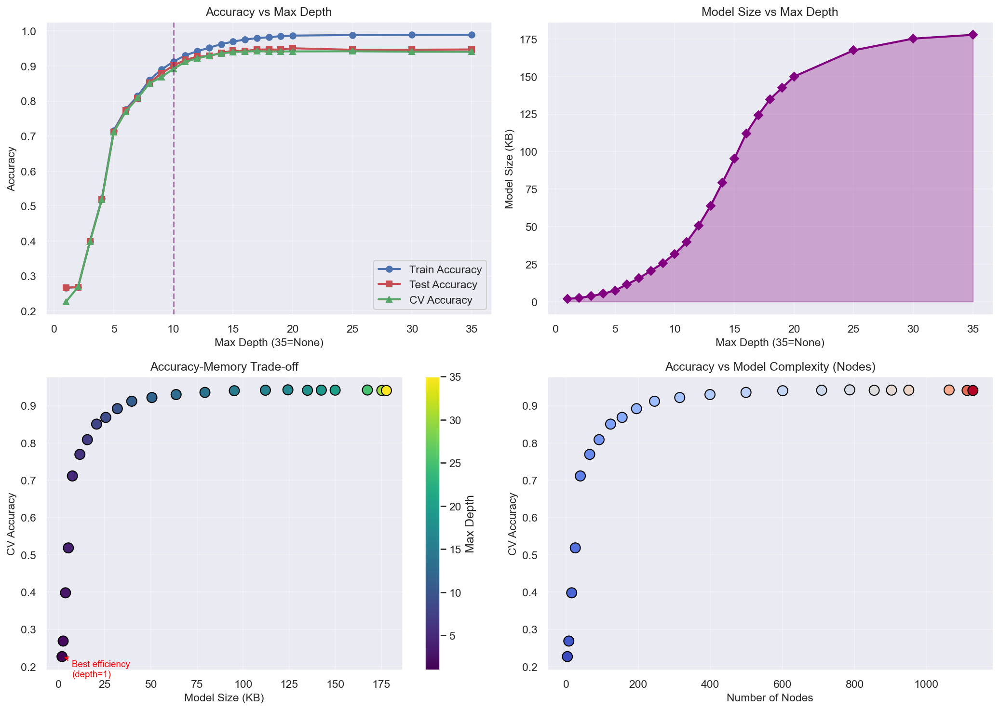

# imu-har-edge

Recognises human activities on a microcontroller. An Arduino Nicla Vision worn on the wrist samples its 6-axis IMU at 60 Hz and computes 126 features per 20-sample window. A decision tree compiled into plain MicroPython `if`/`else` code then picks one of 12 activities, and the board streams the smoothed prediction to a PC over UDP.

This was a course assignment for Edge AI (CP330), M.Tech CDS, IISc, 2026.

## Results

All numbers come from the saved outputs of [`notebooks/model_development.ipynb`](notebooks/model_development.ipynb). The test set is a stratified 80/20 split (`random_state=42`) of 26,819 windows x 126 features from 12 activities: 21,455 windows for training and 5,364 for testing. Sizes are joblib files, where the notebook's "KB" means 1,024 bytes.

| Model (Optuna-tuned) | Test accuracy | Macro F1 | Weighted F1 | Serialized size |
|---|---:|---:|---:|---:|
| **Decision tree** (deployed): entropy, max_features 0.5, min_samples_leaf 4 | **94.48%** | **0.9329** | 0.9449 | **137,529 B (134.31 KiB)**; depth 18, 851 nodes (426 leaves) |
| Random forest: 100 trees, max_depth 10 | 97.35% | 0.9676 | 0.9735 | not measured for this model |
| Logistic regression: L1, C = 10 | 96.79% | 0.9622 | 0.9678 | not measured |

A second tuning pass in the same notebook (with `class_weight='balanced'`) measured the size cost directly:

| Model | Test accuracy | Size |
|---|---:|---:|
| Decision tree, depth 18 | 94.61% | 169.62 KiB |
| Random forest, 100 trees, depth 15 | 97.80% | 14,876.79 KiB (about 15 MB) |
| Logistic regression, lbfgs, unscaled features | 41.74% | 12.83 KiB |

The single tree gives up about 3 points of accuracy against the forests, but it is roughly 100x smaller (88x to 110x, depending on which pair is compared). It also compiles to 425 comparisons, of which a single prediction runs at most 18, with no runtime library at all. That is why it was the one deployed. A depth sweep (gini, balanced) shows where the accuracy curve flattens: depth 10 gives 90.1% at 31.8 KiB (195 nodes), and depth 18 gives 94.7% at 134.9 KiB (855 nodes).



### Firmware vs training features (new check, see below)

| | Before fix | After fix |
|---|---:|---:|
| Features that differ from the training code (of 126) | 40 | 0 (to 1e-6 relative) |
| Windows where the on-device tree picks a different class | 145 / 2,388 (6.1%) | 0 / 2,388 |
| Agreement with the label on the sample windows | 91.79% | 96.73% (same as training features) |

## How it works

```
Nicla Vision (MicroPython)                                         PC
--------------------------                                         --
LSM6DSOX accel + gyro, 60 Hz
 |
 |-- firmware/main.py ------ UDP :5006 "ts,ax,ay,az,gx,gy,gz" ---> host/receive_data.py (CSV per activity)
 |                                                                 host/imu_data_visualizer.py (live plot)
 |
 '-- firmware/model_deployment.py
       buffer 20 samples, step 10 (50% overlap, new window every ~167 ms)
       126 features = 20 statistics x 6 axes + the last raw sample
         (mean, std, min, max, range, var, skew, kurtosis, energy, entropy,
          RMS, ZCR, MAD, median, IQR, lag-1 autocorrelation, waveform length,
          dominant DFT bin, spectral entropy, jerk std)
       decision tree as nested if/else (generated from the sklearn tree)
       majority vote over the last 5 predictions, LED colour per class group
       ----------------------- UDP :5007 "ts,class,name,ax..gz" @ 2 Hz ---> host/prediction_visualizer.py
```

- **Data:** one wearer recorded each of 12 activities for about 5 minutes at 60 Hz. Sitting has 2 sessions and standing has 3. In total that is 15 recordings and 268,402 samples (about 75 minutes). The activities are sitting, standing, walking, brisk walking, jogging, cycling, stair up, stair down, sit-stand-sit, phone interaction, eating with a spoon, and pick-and-place.
- **Model export:** `model_development.ipynb` turns the fitted tree into MicroPython source: one `if features[i] <= t` per split and one `return class` per leaf. The same notebook also writes `model/decision_tree_rules.txt` (sklearn text export), `model/decision_tree_embedded.h` (C++ via micromlgen) and `model/decision_tree_m2cgen.py` (pure Python via m2cgen).
- **Notebooks:** `model_development.ipynb` is the final pipeline: EDA, five CV strategies, gini vs entropy, Optuna tuning, feature importance, the size/accuracy sweep and firmware generation. `Classification_with_Optuna.ipynb` and `Classification_without_Optuna.ipynb` are earlier iterations. Their loader skipped the `_segN` sitting/standing files, which leaves 11 classes and 19,642 windows. The final notebook fixes this.

## Validation

- **Held-out test set:** 5,364 windows, stratified by class. Confusion matrices and per-class reports are in the notebook. The weakest classes are stair down (F1 0.81) and stair up (F1 0.84), which get confused with each other, with walking, and with sit-stand-sit.
- **Cross-validation:** stratified 5-fold CV of the default tree gave 94.09% ± 0.40%, in line with the test split.
- **Train/serve parity:** [`tests/check_feature_parity.py`](tests/check_feature_parity.py) runs the notebook's NumPy feature code and the firmware's pure-Python feature code on every window of `data/sample/`, then feeds both through the deployed tree. The check found that the shipped firmware computed 40 of the 126 features differently from training:
  - sample instead of population moments for skew
  - excess instead of plain kurtosis
  - floor-index instead of interpolated IQR
  - a lag-1 autocorrelation that shares one mean between the two shifted series
  - a jerk "std" computed without removing the mean
  - sign(0) treated as positive in ZCR
  - slightly different histogram edges for entropy

  As a result, the tree changed its answer on 6.1% of windows. After the fix (`fix: match firmware feature maths to the training code`), all features agree and every prediction matches.

```bash
python tests/check_feature_parity.py      # needs only numpy
```

## How to run

Host side (Python 3.10 or later):

```bash
pip install -r requirements.txt
cd notebooks && jupyter lab               # IMU_DATA_DIR=/path/to/full/capture to use the full data
streamlit run host/prediction_visualizer.py
python host/receive_data.py               # record a new activity CSV (UDP :5006)
```

Board side (Arduino Nicla Vision, MicroPython with the `lsm6dsox` driver):

1. Copy `firmware/wifi_secrets_example.py` to `firmware/wifi_secrets.py` and fill in the Wi-Fi SSID, password and the PC's IP address. This file is gitignored.
2. Copy `wifi_secrets.py` and either `main.py` (raw streaming) or `model_deployment.py`, renamed to `main.py` (on-device inference), to the board.
3. Allow UDP 5006/5007 through the PC firewall. On Windows the firewall silently dropped the packets until a rule was added.

## Data

`data/sample/` holds the first 2,000 rows (about 33 s) of each activity, 1.9 MB in total. That is enough to run the notebooks end to end and the parity check, but not to reproduce the reported accuracies. The full capture is 268,402 rows (about 21 MB) with columns `timestamp_ms, ax, ay, az, gx, gy, gz, activity`; accel is in g and gyro in deg/s. It is not committed. Point `IMU_DATA_DIR` at it.

## Limitations

- **The test accuracy is optimistic.** Windows overlap by 50% and come from long continuous sessions, and the split is random by window, so neighbouring windows of the same session land in both train and test. A split by session, or a separate recording session for testing, would give a more honest number. The notebook's `TimeSeriesSplit` (12.3%) does not measure this either, because the data are ordered by activity, so each fold is tested on activities it never saw.
- One subject, one sensor placement, one recording day. There is no evidence that it generalises to other people.
- On-device latency, RAM and flash use were not measured. The report's under-200 ms end-to-end latency was not re-verified: the board was not available for the final demo, and the feature fix has not been run on hardware yet. The 134.31 KiB figure is the joblib file, not the MicroPython bytecode size.
- MicroPython on the board uses 32-bit floats. The parity check runs in 64-bit on the host, so values very close to a split threshold could still flip on the board.
- For a window with constant values, the firmware returns 0 for autocorrelation where NumPy returns NaN. No sample window hits this case.

## Layout

```
firmware/   main.py (UDP streamer), model_deployment.py (on-device inference), wifi_secrets_example.py
host/       receive_data.py, imu_data_visualizer.py, prediction_visualizer.py
notebooks/  model_development.ipynb, Classification_with_Optuna.ipynb, Classification_without_Optuna.ipynb
model/      decision_tree_model.joblib, decision_tree_rules.txt, decision_tree_embedded.h, decision_tree_m2cgen.py
figures/    accuracy_memory_tradeoff.png, confusion_matrices.png, model_comparison.png
data/sample/  2,000-row sample per activity
tests/      check_feature_parity.py
```

## License

MIT, see [LICENSE](LICENSE).
